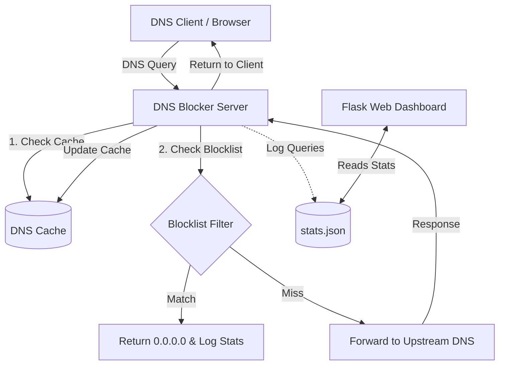

# 🛡️ DNS Blocker & Web Dashboard

A lightweight, high-performance, and custom DNS blocking server written in Python. It intercepts DNS queries, blocks ad/tracking/malware domains using remote blocklists, caches healthy resolutions for speed, and exposes a beautiful local web dashboard for query analytics.

---

## 🚀 Features

- **Ad & Tracker Blocking:** Automatically parses host-based blocklists (such as StevenBlack's hosts file) to block malicious/ad domains.
- **Smart DNS Caching:** In-memory caching with automatic TTL management to dramatically speed up repeat DNS lookups.
- **Flask Web Dashboard:** Beautiful local dashboard showing:
  - Real-time stats (Total queries, blocked queries, block rate, cache hit rate).
  - List of Top 10 Blocked Domains.
  - 24-Hour query volume timeline.
- **Graceful Persistence:** Saves analytics and metrics to a local file (`stats.json`) on shutdown.
- **Dockerized Ready:** Packaged with `Dockerfile` and `docker-compose.yml` for zero-install deployment.

---

## 🛠️ Architecture



---

## ⚙️ Configuration (`config.yaml`)

Customize the behavior of the DNS blocker using the `config.yaml` file:

```yaml
server:
  port: 53                  # Port to listen on (use 53 for system-wide, requires root)
  bind_address: '0.0.0.0'   # Network interface to bind to

upstream_dns:
  - '8.8.8.8'               # Primary upstream DNS resolver
  - '1.1.1.1'               # Secondary fallback resolver

blocklists:
  - 'https://raw.githubusercontent.com/StevenBlack/hosts/master/hosts'

cache:
  max_size: 5000              # Maximum cache entries
  default_ttl: 300            # Fallback TTL in seconds

dashboard:
  enabled: true
  port: 8080
  host: '0.0.0.0'
```

---

## 🐳 Quick Start (Docker Compose)

Deploy the DNS blocker and the dashboard instantly using Docker Compose:

```bash
docker-compose up --build -d
```

- **DNS Blocker** will run on port `53` (UDP).
- **Web Dashboard** will run on port `8080` (TCP).

---

## 🐍 Manual Installation & Setup

If you prefer to run the project natively without Docker:

### 1. Install Dependencies
Ensure you have Python 3.8+ installed, then install the required libraries:
```bash
pip install -r requirements.txt
```

### 2. Run the DNS Blocker
To run the server:
```bash
# Needs administrative/root privileges if binding to port 53
sudo python dns_blocker.py
```

### 3. Run the Analytics Dashboard
In a separate terminal:
```bash
python dashboard.py
```
Visit the dashboard at **`http://localhost:8080`** in your browser.

---

## 🧪 Testing the DNS Blocker

You can test that queries are resolving or being blocked using `dig` or `nslookup`:

**Verify normal resolution:**
```bash
dig @127.0.0.1 -p 5353 google.com
```

**Verify ad domain blocking (returns `0.0.0.0`):**
```bash
dig @127.0.0.1 -p 5353 doubleclick.net
```
